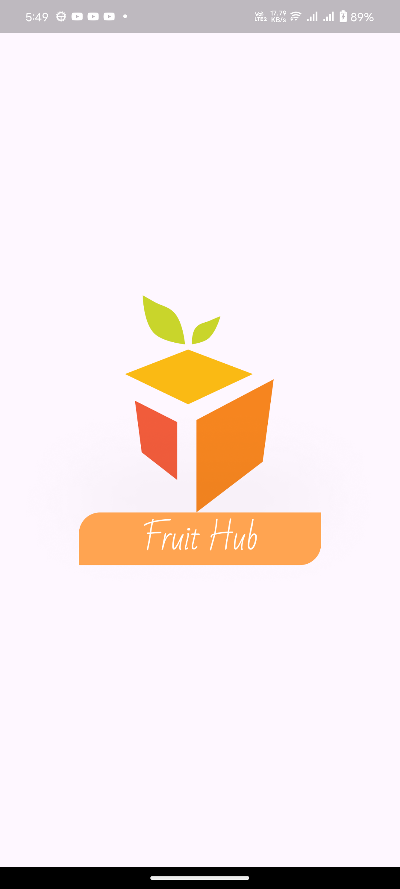
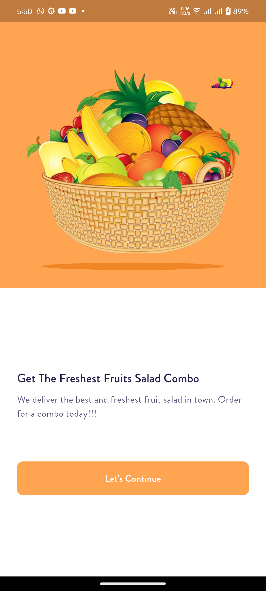
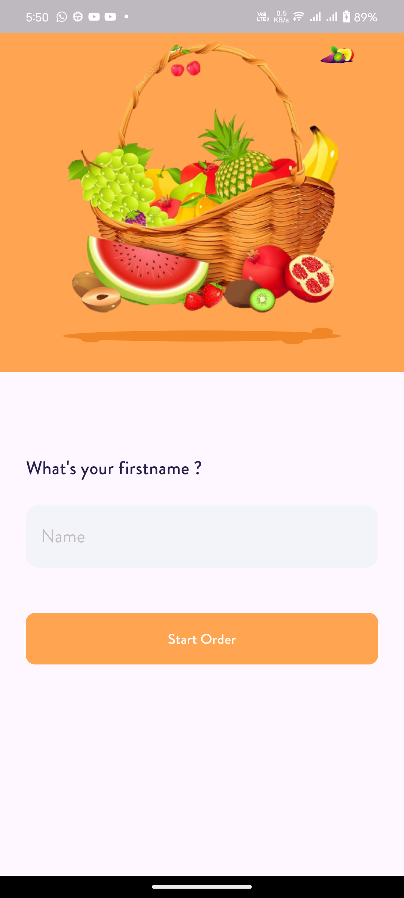
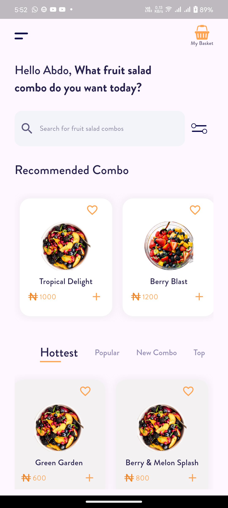
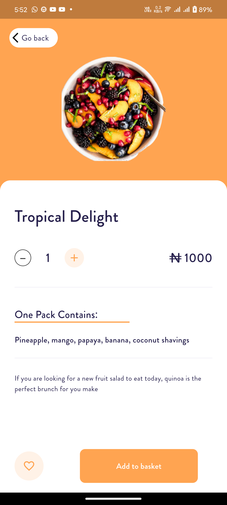
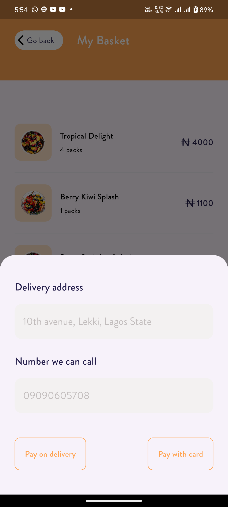
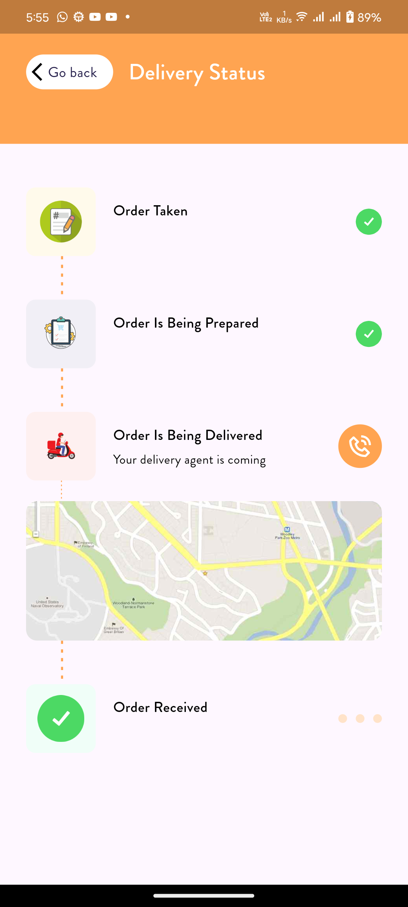
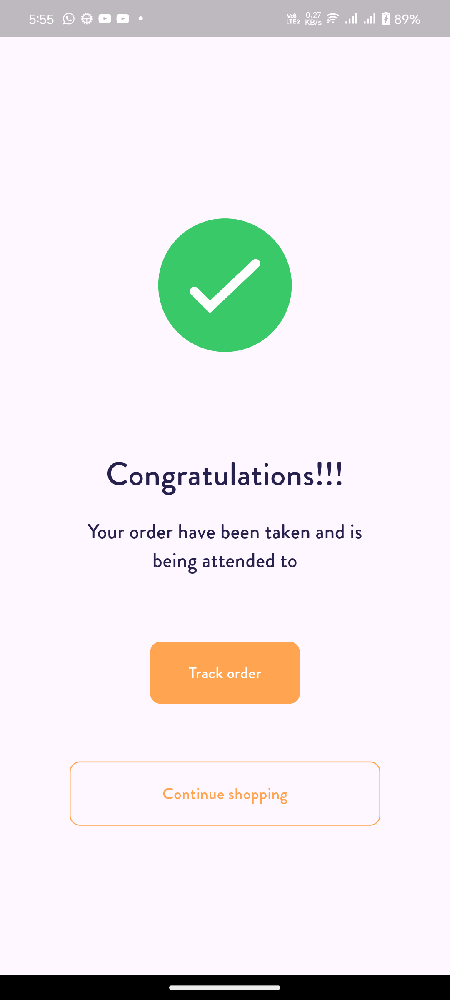

# Ecommerce UI Fruits App 🍎🍌🍓

This is a mobile application for a fruit e-commerce store, built using Flutter and inspired by the [Ecommerce UI Kit](https://www.figma.com/design/8KG9uAt5CBr0sJ8MoDHwDr/Mobile-UI-Kit%3A-Ecommerce-(Community)?node-id=12-0&node-type=canvas&t=DSdJ4fwhXB4Qmrac-0) designed on Figma. The app allows users to explore a variety of fresh fruits, add items to their basket, and place orders seamlessly with a clean and user-friendly interface.

## Features

- **Welcome Screen**: A visually appealing splash and onboarding screen to introduce users to the app.
- **Product Listings**: View a list of fresh fruits with details, images, and prices.
- **Basket**: Add fruits to your basket, adjust quantities, and view the total cost.
- **Authentication**: Simple authentication screen to allow users to log in.
- **SQLite Integration**: Local storage of basket items using SQLite.
- **Responsive UI**: Optimized for various screen sizes and resolutions.
- **Beautiful Animations**: Subtle animations to enhance user experience.

## Screenshots

| Splash Screen | Welcome Screen | Authentication Screen |
|---|---|---|
|  |  |  |

| Home Screen | Add To Basket Screen | Order List Screen |
|---|---|---|
|  |  |  |

| Complete Details | Track Order | Order Complete.png |
|---|---|---|
|  |  |  |

## Getting Started

### Prerequisites

- **Flutter**: Make sure you have Flutter installed on your local machine. [Get started with Flutter here](https://flutter.dev/docs/get-started/install).
- **Figma API Key (Optional)**: If you wish to further customize the Figma design, you may need an API key to sync design updates.
